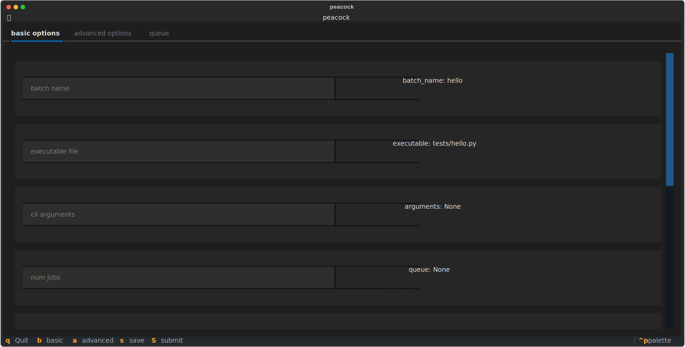

# 🦚 peacock 🦚

**IMPORTANT:** This repo is under heavy active development and will be changing rapidly

## Introduction
This is a command line interface for the Condor Job Scheduling Manager created by the University of Wisconsin-Madison.
All that this package offers is write (and in the future possibly submit) your Condor job files, it should generally be used as a learning tool or as a way to quickly submit a job that you don't care about.



## Installation
To install this package simply clone it and pip install it!
```bash
$ git clone https://github.com/Diego-Llanes/peacock.git
$ cd peacock
$ pip install .
$ echo "wow that was easy!"
```

## Usage
Once installed you can call it anywhere from the command line by simply calling `peacock`.
If you want specific defaults to always be populated, you can specify them in your config file, which you will need to [configure](#Configuration).
Once you have these defaults specified, you use them by calling `peacock [name of your default]`.

## Configuration
To configure this tool you need to have `config.toml` your `~/.config/peacock/` directory.
```bash
$ mkdir -p ~/.config/peacock/
$ touch ~/.config/peacock/config.toml
$ $EDITOR ~/.config/peacock/config.toml
```
At the very top of this file is where you put your global configuration parameters like your default override profile, theme and refresh rate.
In this file you will create categories of "environments" that specify what the default value of each command should be.
These categories can have subcategories for example you could have a group called `projects` that has a project named `diff` and another named `llm`.
An example of what this file might look like is:
```toml
theme = "monokai"
primary_default = "projects.diff"
update_time = 1

[projects]

[projects.diff]
batch_name = "diff"
executable = "tests/diff.py"
universe = vanilla

[projects.llm]
batch_name = "llm"
executable = "tests/llm.py"
universe = java
```

## Selecting Default Profiles

If you would like to select a default profile to use from the command line, you can simply state which profile you would like t use in your call: `peacock projects.llm`.
This will populate peacock with the defaults that you specified to use in your config file.

## Submitting Jobs

Peacock will allow you to submit a job by using the keyboard shortcut `Shift+s`, which will send all populated fields as a job, or you can simply press `s` which will save the job to your current working directory.

